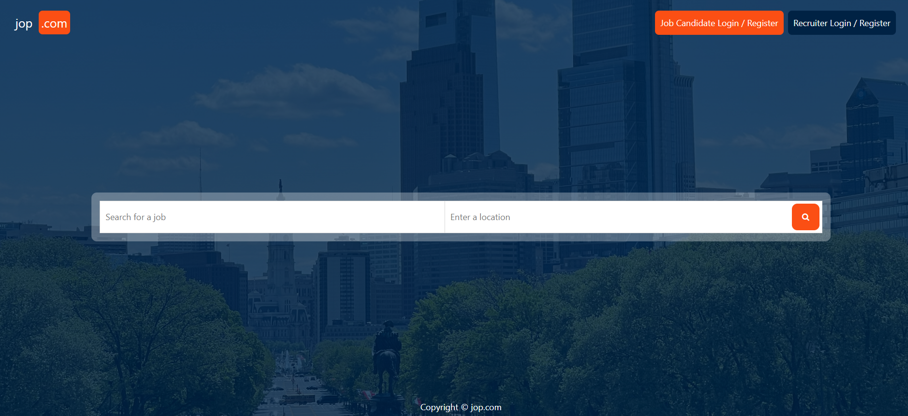
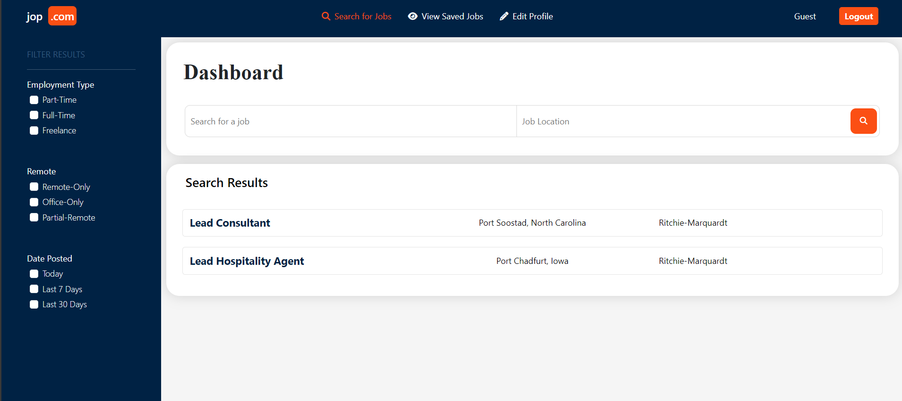
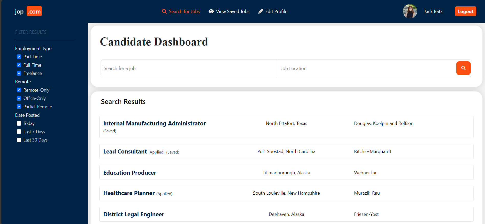
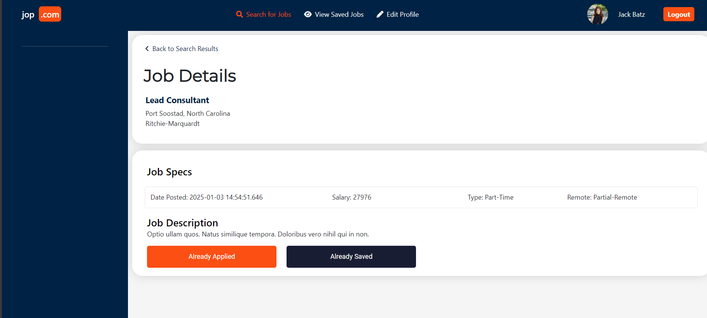
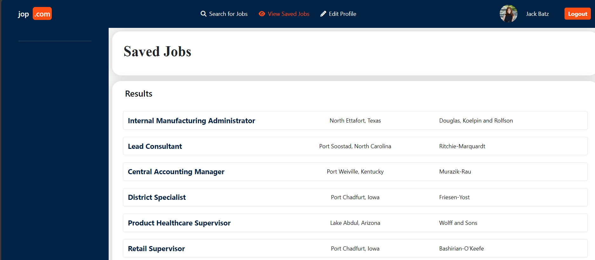
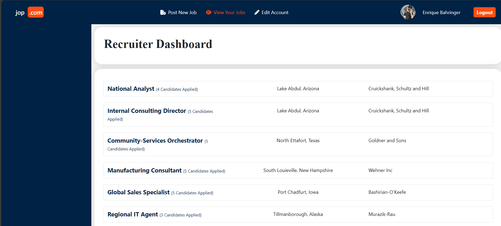
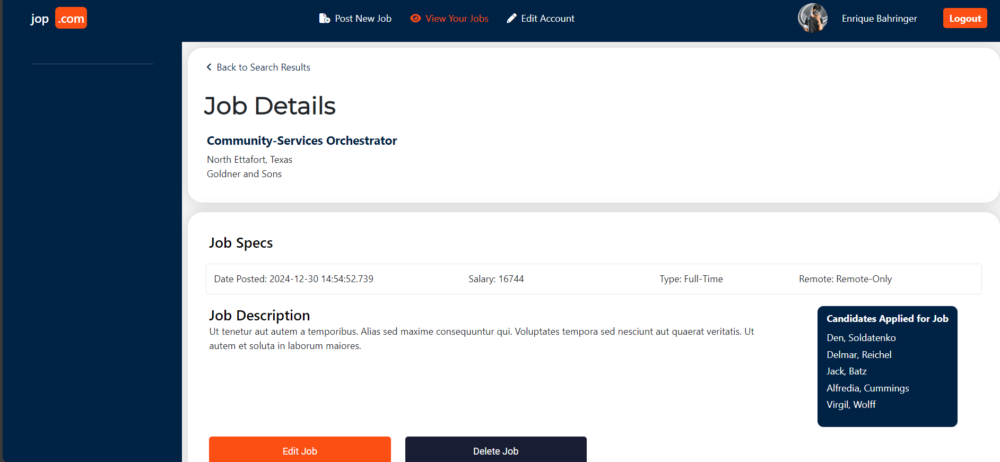

# Job Opportunity Platform project

The **Job Opportunity Platform** is a dynamic online platform built using **Spring Boot** and **Thymeleaf**, designed to connect **job seekers** and **recruiters**. It streamlines the job search and recruitment process, providing a feature-rich environment for interaction, job vacancy postings, job applications, and profile management.

The platform supports two primary user roles: **Job Seekers** and **Recruiters**, each with distinct features and capabilities.

**Job Seekers** can:
- **Browse** and **search** through a comprehensive list of job vacancies posted by various recruiters, filtering them by categories, locations, and other criteria.
- **Seamlessly apply** for jobs by submitting their resumes and cover letters.
- **Bookmark** job vacancies, allowing them to save and revisit job opportunities that interest them.

**Recruiters** can:
- **Post** job vacancies with detailed descriptions, requirements, and benefits.
- **Manage** job postings and update vacancy details as needed.
- **View** and **shortlist** candidates for various job positions.
- **Download** resumes submitted by job seekers, allowing for detailed review and evaluation.

Both job seekers and recruiters can create and manage detailed profiles, including personal information, work experience, and educational backgrounds. Job seekers can provide comprehensive information about their educational background, including schools, degrees, majors and graduation years.

The application implements **secure user registration** and **authentication** to ensure data and account security. It also features a **responsive design**, ensuring a seamless experience on various devices, including desktops, tablets, and smartphones.

## Screenshots

Here are some screenshots demonstrating the features of the Job Opportunity Platform:

### Homepage

*The homepage features a clean layout, job search functionality, and user login/signup options.*

### Job Listings (Guest Search)

*Guests can search for job vacancies, filter by categories, and view details.*

### Job Seeker Dashboard

*Job seekers can view their applications, saved jobs, and profile details.*

### Job Details

*Detailed view of a job posting, including role description, requirements, and benefits.*

### Saved Jobs

*Job seekers can save job postings that interest them for future reference.*

### Recruiter Dashboard

*Recruiters can post job vacancies, manage listings, and review applications.*

### Candidates Applied

*Recruiters can see a list of candidates who have applied for their job postings.*